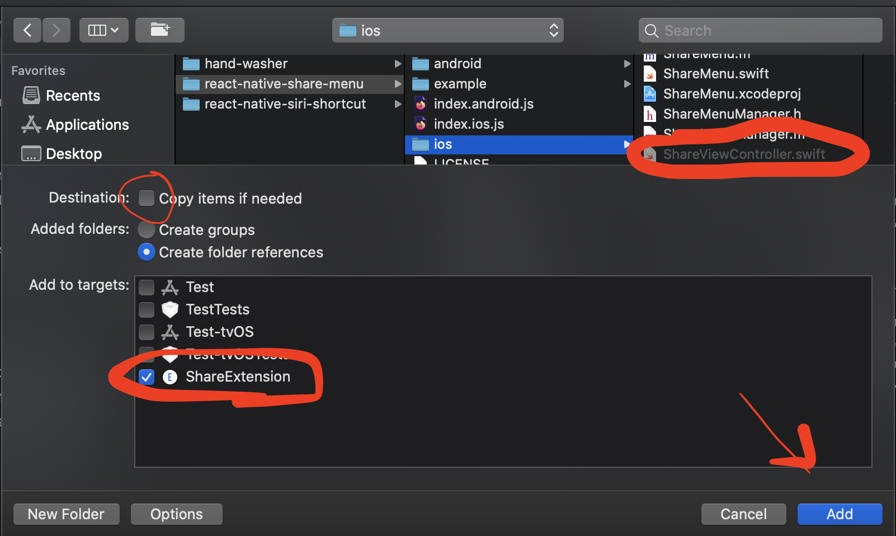

# iOS Installation

## Create Share Extension

Create a Share Extension by going to your project settings


Then creating a new target


And choosing Share Extension


Name your extension and make sure you've selected Swift as the language to use

Select your new target, go to `Build Settings`, search for `iOS Deployment Target` and make sure it matches your app's target (iOS 10.0 in RN 0.63)

When your extension has been created, delete the `ShareViewController.swift` file generated by Xcode in the extension folder, right click on the folder, and choose `Add Files to "ProjectName"`

On the pop-up, select `node_modules/react-native-share-menu/ios/ShareViewController.swift`. Make sure `Copy items if needed` is NOT selected and that the selected target is your newly created Share Extension



## Edit Podfile

Make these changes to your Podfile:

```diff
target '<PROJECT_NAME>' do
  config = use_native_modules!

  use_react_native!(:path => config["reactNativePath"])

  target '<PROJECT_NAME>Tests' do
    inherit! :complete
    # Pods for testing
  end

  # Enables Flipper.
  #
  # Note that if you have use_frameworks! enabled, Flipper will not work and
  # you should disable these next few lines.
  use_flipper!
  post_install do |installer|
    flipper_post_install(installer)
+    installer.pods_project.targets.each do |target|
+      target.build_configurations.each do |config|
+        config.build_settings['APPLICATION_EXTENSION_API_ONLY'] = 'NO'
+      end
+    end
  end
end

+target '<SHARE_EXTENSION_NAME>' do
+  use_react_native!
+
+  pod 'RNShareMenu', :path => '../node_modules/react-native-share-menu'
+  # Manually link packages here to keep your extension bundle size minimal
+end
```

Run `pod install` in your `ios/` directory.

<details>
<summary>If you're using React Native < 0.62</summary>
<br>
Create a bridging header by right clicking on your project folder:

- Selecting New File...
- Choose Swift
- Make sure the selected target is your main app target
- Create the file and say yes to creating a Bridging Header file
- Delete everything in the Swift file, but keep the file around
</details>

## Create App Group and URL Scheme

Create an App Group to be able to share data between your extension and your app. To do so, go to your app target's settings, go to `Signing & Capabilities`, press `+ Capability` and select `App Groups`


At the bottom of the window on Xcode you should see an `App Groups` section. Press the `+` button and add a group named `group.YOUR_APP_BUNDLE_ID`.

Repeat this process for the Share Extension target, with the exact same group name.

Add the following to your app's `Info.plist` (if you already had other URL Schemes, make sure the one you're adding now is the FIRST one):

```OpenStep Property List
<key>CFBundleURLTypes</key>
<array>
    <dict>
        <key>CFBundleTypeRole</key>
        <string>Editor</string>
        <key>CFBundleURLSchemes</key>
        <array>
            <string>A_URL_SCHEME_UNIQUE_TO_YOUR_APP</string>
            <!-- This url scheme doesn't contain :// at the end - E.G. "mycustomscheme"-->
        </array>
    </dict>
</array>
```

Add the following to your Share Extension's `Info.plist`:

```OpenStep Property List
<key>HostAppBundleIdentifier</key>
<string>YOUR_APP_TARGET_BUNDLE_ID</string>
<key>HostAppURLScheme</key>
<string>YOUR_APP_URL_SCHEME_DEFINED_ABOVE</string>
<!-- This url scheme CONTAINS :// at the end - E.G. "mycustomscheme://"-->
<key>NSExtension</key>
<dict>
    <key>NSExtensionAttributes</key>
    <dict>
        <key>NSExtensionActivationRule</key>
        <dict>
            <!-- For a full list of available options, visit https://developer.apple.com/library/archive/documentation/General/Reference/InfoPlistKeyReference/Articles/AppExtensionKeys.html#//apple_ref/doc/uid/TP40014212-SW10 -->
            <key>NSExtensionActivationSupportsImageWithMaxCount</key>
            <integer>1</integer>
            <key>NSExtensionActivationSupportsText</key>
            <true/>
            <key>NSExtensionActivationSupportsWebURLWithMaxCount</key>
            <integer>1</integer>
        </dict>
    </dict>
    <key>NSExtensionMainStoryboard</key>
    <string>MainInterface</string>
    <key>NSExtensionPointIdentifier</key>
    <string>com.apple.share-services</string>
</dict>
```

## Edit AppDelegate.m

Finally, in your `AppDelegate.m` add the following:

```Objective-c
...
#import <RNShareMenu/ShareMenuManager.h>

...

@implementation AppDelegate
    ...

    - (BOOL)application:(UIApplication *)app
            openURL:(NSURL *)url
            options:(NSDictionary<UIApplicationOpenURLOptionsKey,id> *)options
    {
      return [ShareMenuManager application:app openURL:url options:options];
    }
@end
```
