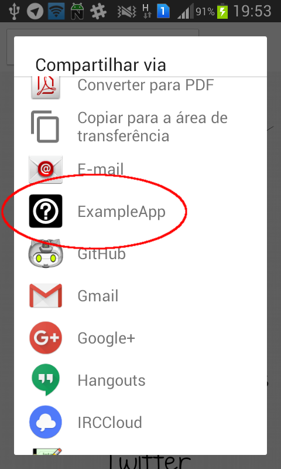
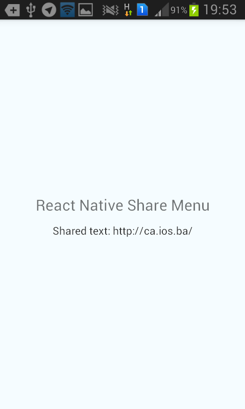
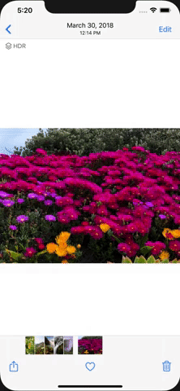

# react-native-share-menu

[](https://www.npmjs.com/package/react-native-share-menu)

Add your app as a target for sharing from other apps and write iOS Share Extensions in React Native.

## Installation

```bash
npm i --save react-native-share-menu
```

### Automatic Linking (React Native 0.60+)

At the command line, in the ios directory:

```bash
pod install
```

### Manual Linking (React Native 0.36+)

At the command line, in the project directory:

```bash
react-native link
```

## [Android Instructions](ANDROID_INSTRUCTIONS.md)

## [iOS Instructions](IOS_INSTRUCTIONS.md)

## [Custom iOS Share View (optional)](SHARE_EXTENSION_VIEW.md)

## [API Docs](API_DOCS.md)

## [Example Project](example/)

### Example Usage

```javascript
import React, { useState, useEffect, useCallback } from "react";
import { AppRegistry, Text, View, Image, Button } from "react-native";
import ShareMenu, { ShareMenuReactView } from "react-native-share-menu";

type SharedItem = {
  mimeType: string,
  data: string,
  extraData: any,
};

const Test = () => {
  const [sharedData, setSharedData] = useState(null);
  const [sharedMimeType, setSharedMimeType] = useState(null);

  const handleShare = useCallback((item: ?SharedItem) => {
    if (!item) {
      return;
    }

    const { mimeType, data, extraData } = item;

    setSharedData(data);
    setSharedMimeType(mimeType);
    // You can receive extra data from your custom Share View
    console.log(extraData);
  }, []);

  useEffect(() => {
    ShareMenu.getInitialShare(handleShare);
  }, []);

  useEffect(() => {
    const listener = ShareMenu.addNewShareListener(handleShare);

    return () => {
      listener.remove();
    };
  }, []);

  if (!sharedMimeType && !sharedData) {
    // The user hasn't shared anything yet
    return null;
  }

  if (sharedMimeType === "text/plain") {
    // The user shared text
    return <Text>Shared text: {sharedData}</Text>;
  }

  if (sharedMimeType.startsWith("image/")) {
    // The user shared an image
    return (
      <View>
        <Text>Shared image:</Text>
        <Image source={{ uri: sharedData }} />
      </View>
    );
  }

  // The user shared a file in general
  return (
    <View>
      <Text>Shared mime type: {sharedMimeType}</Text>
      <Text>Shared file location: {sharedData}</Text>
    </View>
  );
};

const Share = () => {
  const [sharedData, setSharedData] = useState("");
  const [sharedMimeType, setSharedMimeType] = useState("");

  useEffect(() => {
    ShareMenuReactView.data().then(({ mimeType, data }) => {
      setSharedData(data);
      setSharedMimeType(mimeType);
    });
  }, []);

  return (
    <View>
      <Button
        title="Dismiss"
        onPress={() => {
          ShareMenuReactView.dismissExtension();
        }}
      />
      <Button
        title="Send"
        onPress={() => {
          // Share something before dismissing
          ShareMenuReactView.dismissExtension();
        }}
      />
      <Button
        title="Dismiss with Error"
        onPress={() => {
          ShareMenuReactView.dismissExtension("Something went wrong!");
        }}
      />
      <Button
        title="Continue In App"
        onPress={() => {
          ShareMenuReactView.continueInApp();
        }}
      />
      <Button
        title="Continue In App With Extra Data"
        onPress={() => {
          ShareMenuReactView.continueInApp({ hello: "from the other side" });
        }}
      />
      {sharedMimeType === "text/plain" && <Text>{sharedData}</Text>}
      {sharedMimeType.startsWith("image/") && (
        <Image source={{ uri: sharedData }} />
      )}
    </View>
  );
};

AppRegistry.registerComponent("Test", () => Test);
AppRegistry.registerComponent("ShareMenuModuleComponent", () => Share);
```

Or check the "example" directory for an example application.

## How it looks

### Android

 

### iOS



## Releasing a new version

`$ npm version <minor|major|patch> && npm publish`

## Credits

Sponsored and developed by [Meedan](http://meedan.com).

iOS version maintained by [Gustavo Parreira](https://github.com/Gustash).
