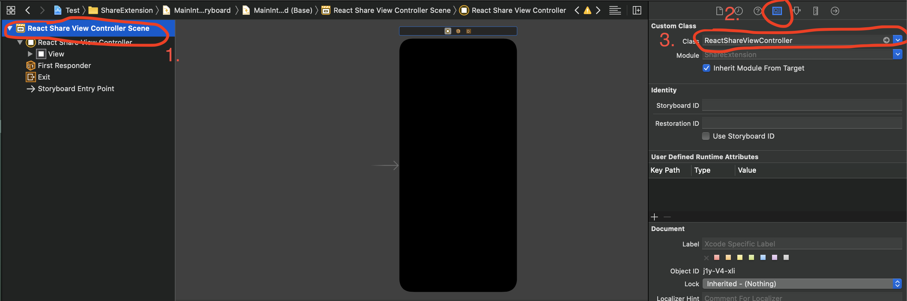
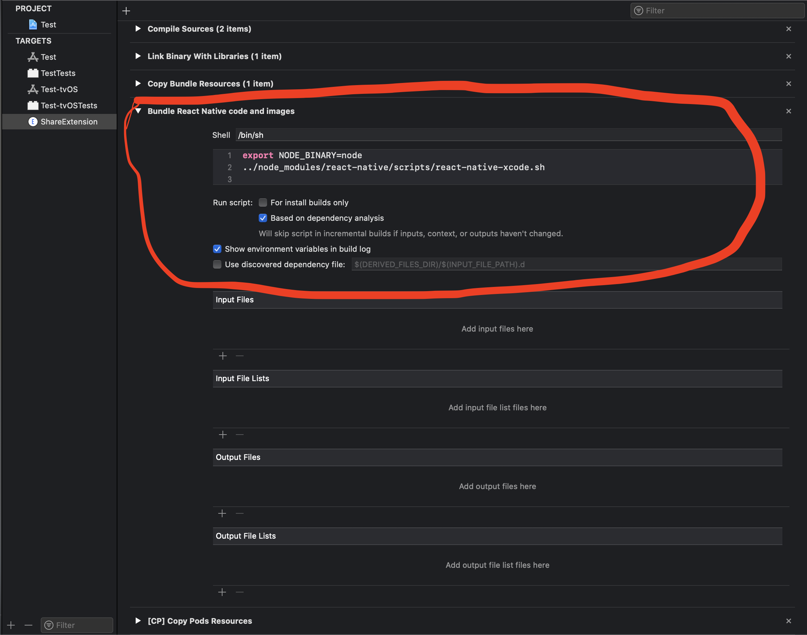
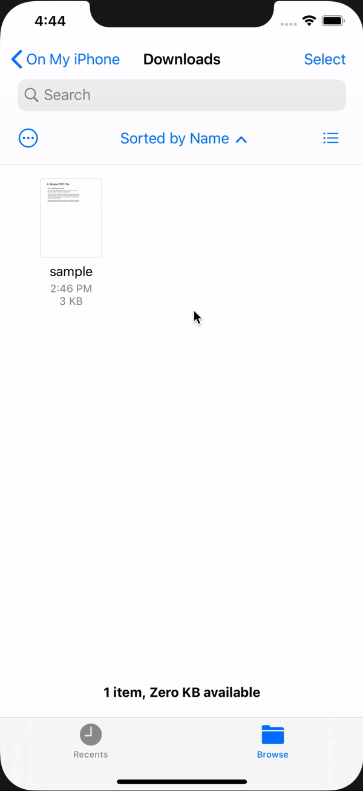

# Custom iOS Share View

### If you want a custom sharing view, do these steps

## Create Bridging Header

Right click on your Share Extension folder, and choose `New File...`

Select Objective-C, make sure the target is your Share Extension

Create the file and say yes when prompted to create a Bridging Header

Delete the created `.m` file

Add the following to the new `Bridging-Header.h` file:

```Objective-c
#import <React/RCTBridge.h>
#import <React/RCTBundleURLProvider.h>
#import <React/RCTBridgeDelegate.h>
#import <React/RCTRootView.h>
```

## Add React View Controller

Right click on your Share Extension folder, and choose `Add Files to "ProjectName"`

On the pop-up, select `node_modules/react-native-share-menu/ios/ReactShareViewController.swift`. Make sure `Copy items if needed` is NOT selected and that the selected target is your newly created Share Extension


Now go to your `MainInterface.storyboard` and:

1. Select the first item in the storyboard inspector

2. Select `Show the Identity Inspector` on the right

3. Replace the value in `Class` with `ReactShareViewController`



## Edit Info.plist

Open your Share Extension's `Info.plist` and add the following:

```OpenStep Property List
<key>ReactShareViewBackgroundColor</key>
<dict>
    <key>Red</key>
    <integer>1</integer>
    <key>Green</key>
    <integer>1</integer>
    <key>Blue</key>
    <integer>1</integer>
    <key>Alpha</key>
    <integer>1</integer>
    <key>Transparent</key>
    <false/>
</dict>
<key>NSAppTransportSecurity</key>
<dict>
    <key>NSAllowsArbitraryLoads</key>
    <true/>
    <key>NSExceptionDomains</key>
    <dict>
        <key>localhost</key>
        <dict>
            <key>NSExceptionAllowsInsecureHTTPLoads</key>
            <true/>
        </dict>
    </dict>
</dict>
```

Feel free to change the values in ReactShareViewBackgroundColor to whatever you want.

## Bundle JS code and assets in your Share Extension

If you're planning to run builds outside the simulator, or to make Release builds, add a `Run Script Phase` to your Share Extension target:

- Go to your Share Extension target's `Build Phases` settings

- Add a new `Build Phase` and select `New Run Script Phase`

- Rename it to `Bundle React Native code and images`

- Leave the shell as `/bin/sh` and paste the following as the script:

```shell
export NODE_BINARY=node
export ENTRY_FILE=index.share.js
../node_modules/react-native/scripts/react-native-xcode.sh
```

- Drag it behind `[CP] Copy Pods Resources`

You should end up with something like this:



## Register Component

Finally, create an `index.share.js` file, register the component you want to render in your Share Extension view:

```javascript
import { AppRegistry } from "react-native";

AppRegistry.registerComponent(
  "ShareMenuModuleComponent",
  () => MyShareComponent
);
```

## Example

If you're rendering an empty component, you should be seeing something similar to this when you share to your app:


